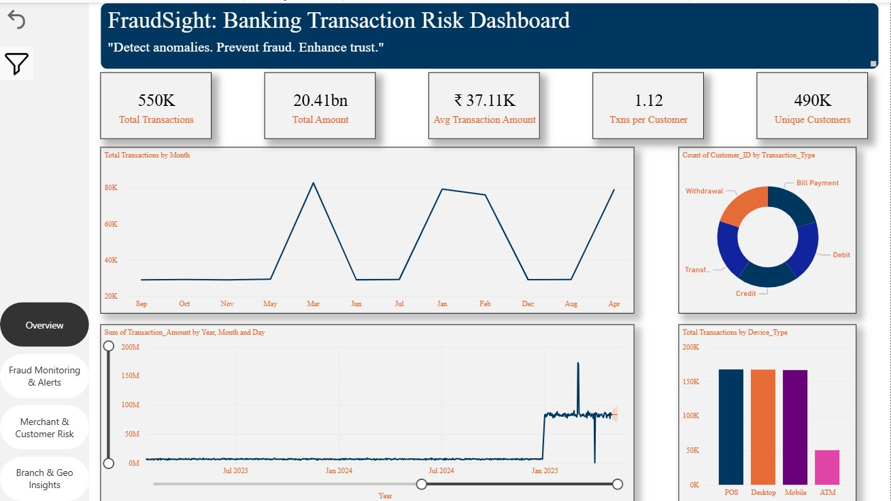
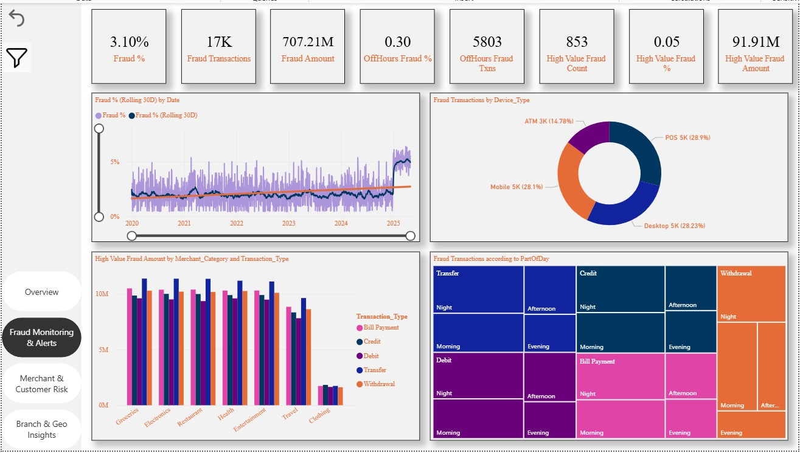
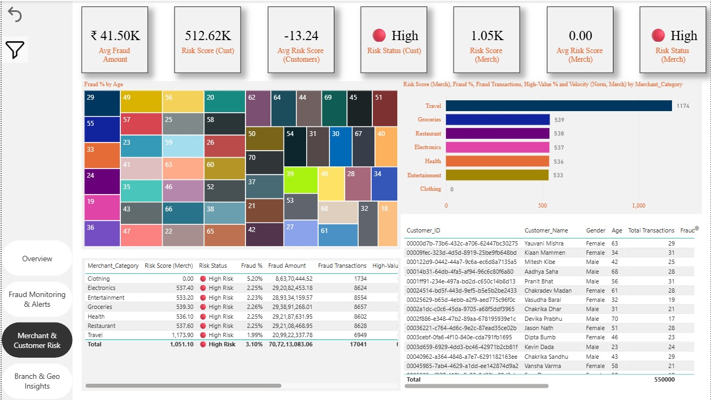
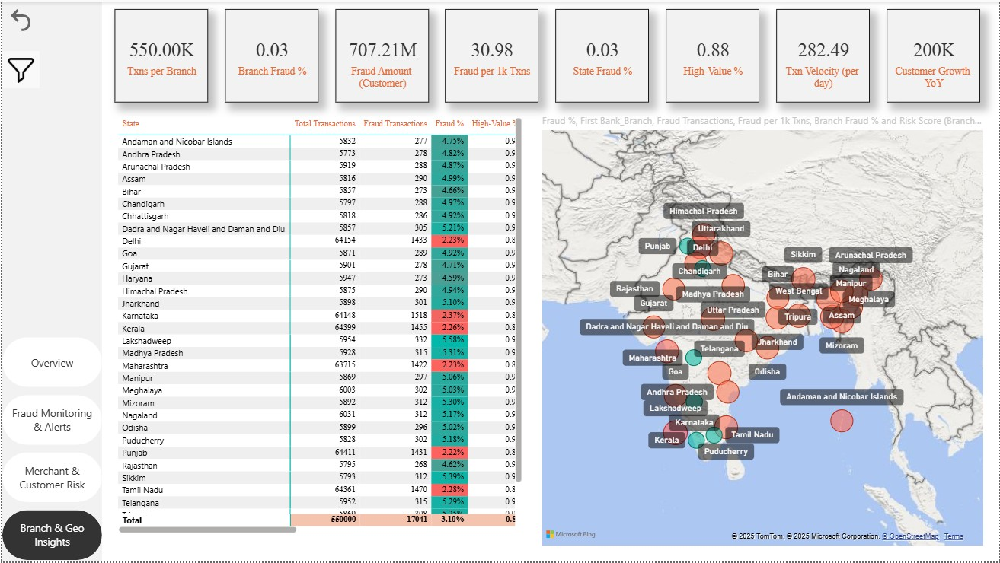

# FraudSight: Banking Transaction Risk Dashboard  
Detect anomalies. Prevent fraud. Enhance trust.

FraudSight is an end-to-end **Banking Fraud Analytics Power BI solution** designed to help financial institutions detect suspicious activity, quantify risk, and monitor fraud patterns across **customers, merchants, branches, time windows, and geography**.

This project combines **advanced DAX**, **risk scoring**, **off-hours detection**, **dynamic insights**, and a **clean investigative UI** to support both analysts and business stakeholders.

---

## 🚀 Project Summary

This repository contains a production-grade **Power BI dashboard** built on transactional banking data. It enables users to:

- Monitor **fraud rates**, **high-value fraud**, and **suspicious patterns**  
- Identify high-risk **customers**, **merchants**, and **branches** using risk scoring models  
- Detect fraud patterns by **time of day**, **off-hours windows**, and **weekends**  
- Analyse geographical risk concentration using **state, city, and branch-level insights**  
- Drill into detailed investigation views with slicers, bookmarks, and tooltips

The dashboard follows a star-schema model with optimized DAX measures and a UI/UX designed for **fraud risk teams**.

---

## 📦 Datasets Used

- Synthetic Banking Transaction dataset (2020–2025)
- Includes:
  - Transaction fact table
  - Customer, Merchant, Branch, Date, and Geography dimension tables

---

## 🧱 Data Model (Star Schema)

**Fact Table: `Transactions`**  
- Transaction_ID  
- Date, Time, TxnHour, PartOfDay  
- Amount, Is_Fraud  
- Customer_ID, Merchant_ID, Branch_ID  
- Device_Type, Payment_Type, Category  

**Dimension Tables**  
- **Customers**: Age, Gender, Segment  
- **Merchants**: Category, Risk Attributes  
- **Branches**: State, City, Urbanicity (Urban/Semi-Urban/Rural), Coastal Flag  
- **Date**: Date, Year, Month, DayName, IsWeekend  

**Engineered Fields**  
- Off-hours flag  
- High-value threshold (What-If parameter)  
- Top-N selector (What-If parameter)  
- Risk Score (Customer / Merchant / Branch)

---

# 📊 Dashboard Overview & Features

---

## 📌 **1) Executive Overview**

  

### **Key KPIs**
- **Total Transactions**  
- **Total Amount**  
- **Avg Amount per Txn**  
- **Txns per Customer**  
- **Unique Customers**

### **Key Visuals**
- Monthly transaction trend  
- Device-type breakdown  
- Customer count by transaction type  
- Date slicer + bookmark filters

---

## 📌 **2) Fraud Monitoring & Alerts**

  

### **Key KPIs**
- Fraud %  
- Fraud Txns  
- Fraud Amount  
- Off-hours Fraud %  
- High-Value Fraud %

### **Key Visuals**
- Fraud % trend with 30-day rolling line  
- Device-type fraud donut  
- High-value fraud by merchant category  
- Part-of-day fraud heatmap  
- Off-hours spike detection

### **Insights**
- Fraud spikes are concentrated in **late-night windows**  
- Specific device types (e.g., **mobile**, **POS**) show higher fraud share  
- High-value fraud is dominated by **travel**, **groceries**, and **electronics**

---

## 📌 **3) Merchant & Customer Risk**

  

### **Key KPIs**
- Average Fraud Amount  
- Avg Risk Score (Customers)  
- Avg Risk Score (Merchants)  
- Risk Status Indicators  

### **Key Visuals**
- Merchant Risk Score bar chart  
- Customer Risk Score table  
- Fraud % by Age Group heatmap  
- Merchant category risk ranking  
- Dynamic risk insights (auto-generated text)

### **Risk Score Model (0–100 Index)**
Based on:
- Normalized Fraud %  
- Normalized Fraud Transactions  
- High-Value %  
- Velocity / Volume Weight  

### **Insights**
- A small set of merchants contributes disproportionately to fraud  
- Customers aged **25–35** show elevated risk patterns  
- Certain categories (e.g., **Travel**, **Restaurants**) show high merchant-risk scores

---

## 📌 **4) Branch & Geography Insights**

  

### **Key KPIs**
- Txns per Branch  
- Branch Fraud %  
- Fraud per 1k Txns  
- State-wise Fraud %  
- High-Value %  
- Txn Velocity (per day)  
- Customer Growth (YoY)

### **Key Visuals**
- State-level fraud map  
- Branch fraud matrix (State → City → Branch)  
- Branch vs Fraud % bar chart  
- Branch vs Total Txns bar chart  
- Dynamic geo insights

### **Insights**
- High-risk states show strong clustering in **urban centers**  
- Semi-Urban branches appear **2–3× riskier** on a per-1000-txn basis  
- Coastal states show **YoY fraud spikes** during certain periods  
- Branch risk scoring highlights **priority sites** for operations review

---

